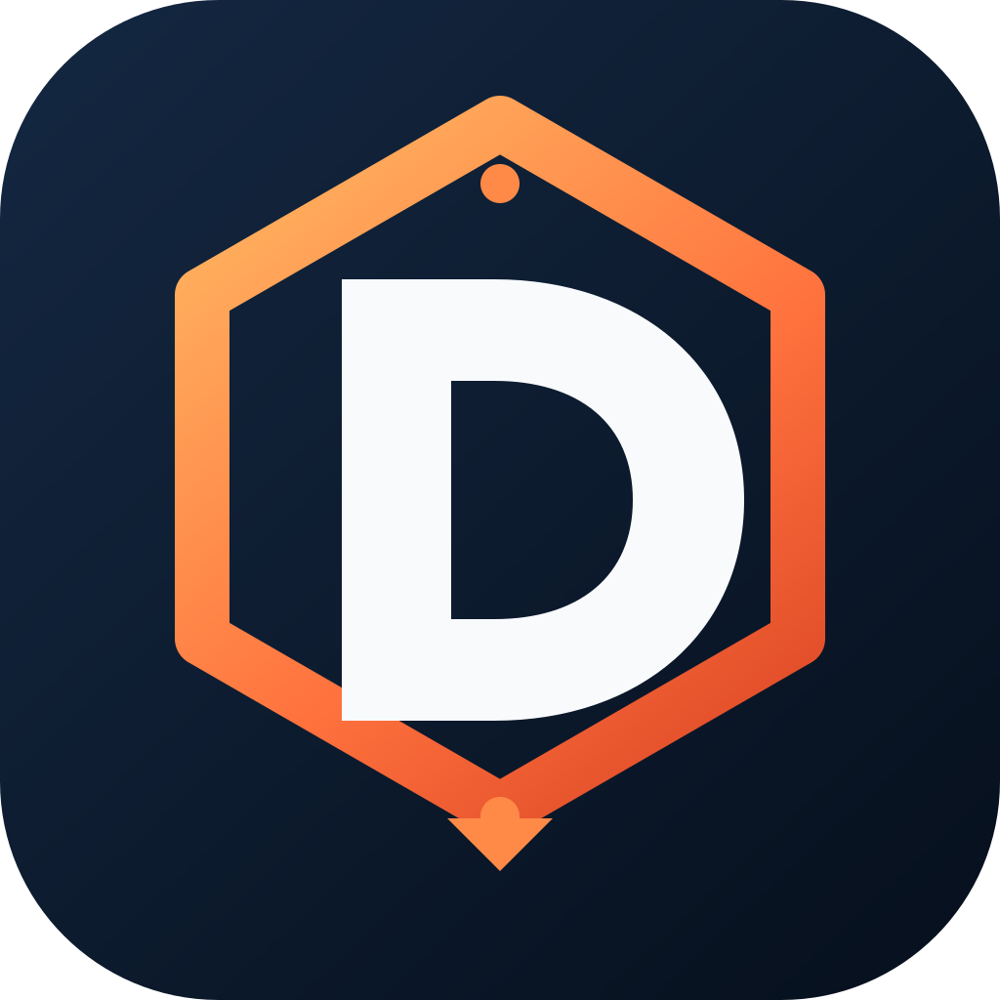

<p align="center">
  <picture>
    <source media="(prefers-color-scheme: dark)" srcset="plugins/deepwright/assets/logo-dark.png">
    
  </picture>
</p>

# Deepwright

**Go deep. Ship sound.**

Deepwright is an evidence-first engineering plugin for Codex. Owl routes complex work through investigation, specification, design, implementation, review, and verification on the real artifact. The Investigator Owl keeps an eye on the evidence.

One implicit router selects the smallest fitting workflow; focused skills remain explicitly invoked. Optional Node 20.19+ helpers provide terminal discovery, project configuration checks, orchestration, and PR watching. The skills themselves do not require Node. The helper's start page reports the current skill and playbook inventory from the installed files.

Deepwright is a native skills-only Codex package. It does not install lifecycle hooks, an MCP server, global settings, or background automation. A request to investigate, specify, plan, or review is not permission to implement, deploy, merge, or take other external actions.

## Install in Codex CLI

You need Codex CLI with plugin support and Git. While this repository is private, you also need repository access and working GitHub authentication.

```bash
codex plugin marketplace add https://github.com/aj2666/deepwright.git --ref main --json
codex plugin add deepwright@deepwright --json
codex plugin list --json
```

SSH is also supported: use `git@github.com:aj2666/deepwright.git` as the marketplace source. Start a **new Codex session** after installation.

Give Owl a goal, a boundary, and a checkable finish condition:

```text
$deepwright:deepwright investigate why this export loses columns. explain the cause and evidence without editing files.
```

```text
$deepwright:owl-agent implement this feature, verify the result, and report what you tested. do not deploy or merge.
```

These are **Codex prompt tokens**, not shell commands. See the [Codex plugin CLI reference](https://learn.chatgpt.com/docs/developer-commands).

## Update

```bash
codex plugin marketplace upgrade deepwright --json
codex plugin add deepwright@deepwright --json
codex plugin list --json
```

Start a fresh Codex session after reinstalling.

## macOS desktop app

Clone the repository and open it as a Codex project in the ChatGPT desktop app. Restart the app, then select the **Deepwright** source in the Plugins Directory and install the plugin. In a fresh chat, type `@` and select **Deepwright**, **Owl**, or a focused skill.

After updating the checkout, restart the app, complete any update or reinstall offered in the Plugins Directory, and start a new chat. Desktop invocation uses the `@` picker rather than the CLI tokens above. See OpenAI's [Plugins guide](https://learn.chatgpt.com/docs/plugins) and [Build plugins](https://developers.openai.com/plugins/build/plugins).

## Choose a workflow

| Task | Skill |
|---|---|
| Route an engineering task | [Deepwright / Owl](plugins/deepwright/skills/deepwright/SKILL.md) |
| Define behavior and acceptance criteria | [Spec](plugins/deepwright/skills/spec/SKILL.md) |
| Understand behavior or rationale | [How](plugins/deepwright/skills/how/SKILL.md) / [Why](plugins/deepwright/skills/why/SKILL.md) |
| Design before implementation | [Architect](plugins/deepwright/skills/architect/SKILL.md) |
| Review correctness, quality, and requirements without fixes | [Interrogate](plugins/deepwright/skills/interrogate/SKILL.md) |
| Build features or fix bugs through a test loop | [TDD](plugins/deepwright/skills/tdd/SKILL.md) |
| Inspect or change project preferences | [Setup Deepwright](plugins/deepwright/skills/setup-deepwright/SKILL.md) |

From a checkout, the optional helper reads canonical metadata and prints guidance:

```bash
plugins/deepwright/skills/deepwright/scripts/deepwright
plugins/deepwright/skills/deepwright/scripts/deepwright skills review --compact
plugins/deepwright/skills/deepwright/scripts/deepwright playbooks performance
plugins/deepwright/skills/deepwright/scripts/deepwright invoke interrogate
plugins/deepwright/skills/deepwright/scripts/deepwright status --json
```

These discovery commands do not launch agents or modify files. All skills remain available through the catalog. See the [terminal reference](docs/TERMINAL.md) for command options and opt-in, print-only AGENTS.md / CLAUDE.md pointers.

## Specify, build, and review

Use `$deepwright:spec` to turn an idea or existing conversation into acceptance criteria without starting implementation. It reuses settled decisions, investigates available facts, and surfaces consequential open choices. The draft stays in the conversation unless writing a document is authorized.

Spec can also [document existing behavior](plugins/deepwright/skills/spec/references/existing-behavior.md) from active code paths and tests, retaining contradictions and unread gaps. Observed behavior does not become an approved requirement automatically.

Architect uses [one shared contract](plugins/deepwright/skills/architect/references/shared-boundary-contract.md) for separately owned consumers and providers, including real serialization and compatibility checks. Before introducing a dependency or substantial helper, [reuse research](plugins/deepwright/skills/architect/references/reuse-research.md) compares existing repository capabilities with adopting, extending, or building.

For an authorized feature build, Owl carries those same criteria through design, behavioral test slices, real-surface verification, and final requirements-aware review. A small, clear change needs a short checklist, not a formal spec or repeated interview. Multi-phase plans tie each unit to observable behavior and genuine dependencies; planning alone does not publish tickets or start the build.

Start with the outcome you need. For example, in a Codex CLI prompt:

```text
$deepwright:deepwright add a case-insensitive name filter to this list using the existing UI pattern. Keep current behavior when the filter is empty, add a focused regression check, and work locally.
```

```text
$deepwright:interrogate review my current changes against the requested behavior. Include uncommitted files, identify actionable defects, and explain what the available test evidence establishes. Do not edit or post comments.
```

Small additions can use direct implementation and a local final review. Architecture exploration and multiple workers are reserved for changes that benefit from them; acceptance checks still apply.

The [acceptance contract](plugins/deepwright/skills/spec/references/acceptance-contract.md) distinguishes proved, failed, blocked, and not-applicable criteria. Missing evidence remains blocked. A green test suite or an implementer's claim does not prove every requirement, and a read-only review does not run tests that may write files or contact services.

Interrogate adds conditional [failure-visibility and test-quality lenses](plugins/deepwright/skills/interrogate/references/focused-lenses.md). For UI state bugs, How traces the [whole click path](plugins/deepwright/skills/how/references/click-path-audit.md), including hidden resets and asynchronous completion order, and identifies a check of the composed user action.

For uncertain investigations, How and Why compare plausible explanations using the next observation that could distinguish them. They trace repeated claims to their original source and stop when another check would not change the answer. [Investigation guidance](plugins/deepwright/skills/deepwright/references/investigation-evidence.md) keeps this extra work conditional on a material uncertainty.

Reviews and handoffs retain [evidence coverage](plugins/deepwright/skills/deepwright/references/evidence-coverage.md): complete, partial, unavailable, not run, or error. For longer authorized tasks, an optional [run evidence helper](plugins/deepwright/skills/deepwright/references/run-evidence.md) preserves selected historical files and carries a fixed attempt allowance and deadline across resumes. It records bookkeeping; host permissions and execution limits remain the host's responsibility.

## Optional configuration

Deepwright works without configuration. Use `$deepwright:setup-deepwright` to inspect preferences or explicitly request changes to `.codex/deepwright.toml`. It never edits Codex's main configuration.

The helper's `config show`, `config check`, and `config template` commands inspect settings, validate them, or print defaults without writing. Run them from the intended project root. Missing settings inherit defaults; invalid configuration is not partially applied. Only the active host can confirm model availability and concurrency. See the [configuration contract](plugins/deepwright/skills/deepwright/references/configuration.md).

## Development

Reflect proposes [scoped lessons](plugins/deepwright/skills/reflect/references/scoped-lessons.md) with evidence, counterexamples, and last verified context. It can analyze supplied recurring failures or review an explicitly named catalog without collecting hidden histories or changing skills automatically. Maintainers can use [matched-run failure analysis](evals/README.md#recurring-failure-analysis) and [catalog content snapshots](plugins/deepwright/skills/reflect/references/catalog-maintenance.md) to select focused improvements.

```bash
npm ci --prefix plugins/deepwright/skills/deepwright/scripts
npm test
```

CI covers dependency auditing, typechecking, helper and evaluator tests, reproducible bundles, metadata rejection controls, workflow linting, package/documentation validation, and real Codex CLI installation on Linux and macOS. A pinned NVIDIA SkillEvaluator job adds static schema, PII, license, Unicode, quality, and advisory Python lint checks, with downloadable reports for every skill. See [Static skill checks](CONTRIBUTING.md#static-skill-checks) to run them locally. The observer corpus supplies fresh project preparation for all 26 cases. Desktop interaction and live-agent behavior require separate checks; passing tooling tests does not establish improved model routing or productivity.

See [Contributing and release checks](CONTRIBUTING.md), the [evaluation protocol](evals/README.md), and the [security policy](SECURITY.md).

The `plugins/deepwright/skills/` directory contains the actual skill instructions, playbooks, principles, and supporting references—not disposable documentation. The marketplace lives in `.agents/plugins/marketplace.json`; the plugin manifest is `plugins/deepwright/.codex-plugin/plugin.json`.

## Origins and license

Deepwright is a substantial Codex-native adaptation of Cursor's MIT-licensed `pstack` plugin. Its workflow concepts were adapted into standard Codex skills and its optional helpers were ported from Bun to Node. Specification, testing, and requirements-review guidance also adapts material from Matt Pocock's MIT-licensed skills. Source revisions, attribution, and dependency notices are preserved in [THIRD_PARTY_NOTICES.md](THIRD_PARTY_NOTICES.md).

Repository additions use the root [Apache-2.0 license](LICENSE). The distributed plugin retains its [MIT license](plugins/deepwright/LICENSE) and [notice](plugins/deepwright/NOTICE.md).

Deepwright is independent and is not affiliated with or endorsed by Cursor or OpenAI.
