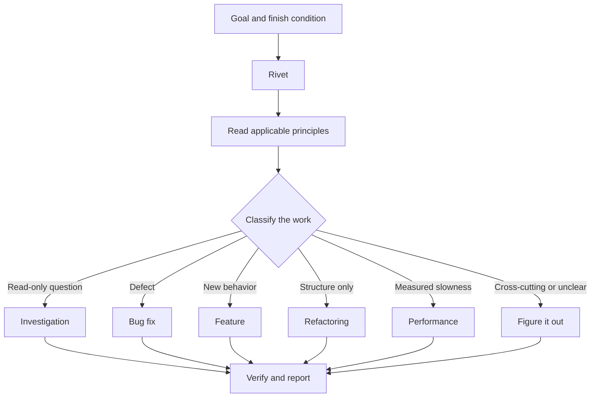

# Route work through `$deepwright:deepwright`

`$deepwright:deepwright` is the front door and Rivet is the foreman. State the outcome,
constraints, and proof you care about. Rivet selects the smallest matching
playbook and calls narrower skills only when their steps are useful.

## What happens to your prompt



The [playbook directory](../../skills/deepwright/playbooks/) also covers
runtime and trace forensics, prototypes, visual parity, metric hillclimbing,
skill authoring and evaluation, pull-request handling, unattended runs,
multi-phase programs, session pickup, safe pauses, and worktree cleanup.

## Say the goal, not the ceremony

```text
$deepwright:deepwright users receive two notifications after a retry. reproduce the behavior first, then fix and verify it.
```

That is enough to select the Bug fix playbook. A phrase such as “reproduce it
first” is a real constraint. A skipped safety, verification, or ownership step
must remain visible with a concrete reason.

When the current Codex session already has the context, a short follow-up can be
enough:

```text
$deepwright:deepwright continue with the smallest verified change
```

For an entirely different subject, say so and restate the new finish condition:

```text
$deepwright:deepwright new task: find why the cache entry survives logout. investigate only; do not edit yet.
```

## Delegate through skills, not invented agent types

Rivet uses the subagent mechanism exposed by the active Codex host. It inherits
the parent model unless `.codex/deepwright.toml` contains a confirmed override.
It never invents an agent type, model slug, environment name, or tool argument.

Use [`$deepwright:rivet-agent`](../../skills/rivet-agent/SKILL.md) when a delegated worker
needs Deepwright's complete engineering contract. It is a portable skill, not a
custom agent manifest:

```text
Have an isolated worker read $deepwright:rivet-agent and own the parser change; review its diff before accepting it.
```

## Isolate parallel writers

Several agents writing into one checkout create conflicts and ambiguous
ownership. Give each writer its own branch and worktree, or non-overlapping file
scope:

```text
$deepwright:deepwright branch from main in a fresh worktree, then port the parser change there.
```

The [Opening a PR playbook](../../skills/deepwright/playbooks/opening-a-pr.md)
already prefers isolated worktrees for code changes. The
[Worktree cleanup playbook](../../skills/deepwright/playbooks/worktree-cleanup.md)
inspects merge state and uncommitted work before proposing cleanup. It must not
delete uncertain work just to reclaim disk.

## Choose the right unattended surface

If you are stepping away, define a predicate that can pass or fail and ask Rivet
to write durable state under `.deepwright/runs/<run-id>/`. The macOS desktop app can own a scheduled
task; Codex CLI cannot manage desktop schedules and instead uses `codex exec`
from a script, CI job, or external scheduler. [Run unattended
work](./07-overnight.md) shows both paths.

**Pitfall:** do not enumerate a long chain such as “use `$deepwright:how`, then
`$deepwright:architect`, then `$deepwright:arena`.” The selected playbook already owns sequencing.
Name a narrower skill only when you intentionally override Rivet's default.

Read [`$deepwright:deepwright`](../../skills/deepwright/SKILL.md) for the complete routing
contract.

Next: [Understand the code](./03-understand.md).
