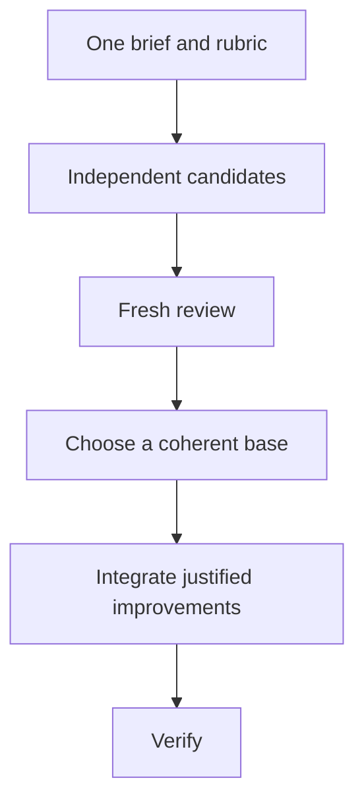

# Design before writing code

One attempt at a consequential design can lock in the first plausible shape.
Rivet uses `$deepwright:architect` to settle boundaries,
`$deepwright:arena` to compare independent candidates, `$deepwright:swarm` to
cover separate slices, and `$deepwright:interrogate` to challenge a result
before it becomes expensive to reverse.

## Settle the shape with `$deepwright:architect`

```text
$deepwright:architect design the import pipeline before writing code. start with the caller experience and the data boundaries.
```

[`$deepwright:architect`](../../skills/architect/SKILL.md) grounds the proposal in the
current implementation with `$deepwright:how`, and uses `$deepwright:why` when
history or ownership matters. For a consequential choice it can ask
`$deepwright:arena` for competing sketches.
Each useful sketch starts with caller usage, then names the data model, public
signatures, failure behavior, and module boundaries.

By default, the selected design can proceed into implementation. Request a
checkpoint when you want to approve a one-way door first:

```text
$deepwright:architect design only. show me the tradeoffs and wait before implementation.
```

## Compare candidates with `$deepwright:arena`

```text
$deepwright:arena compare three designs for this cache-key format. use the same brief and score reversibility, correctness, and migration cost.
```

[`$deepwright:arena`](../../skills/arena/SKILL.md) gives independent workers the same brief
and rubric. Writers use separate worktrees or directories. A fresh reviewer
scores the complete candidates, then the coordinator chooses a base and carries
over only improvements that remain coherent in that base.



Workers inherit the parent Codex model unless the active host exposes and
confirms another choice in `.codex/deepwright.toml`. Independence comes from
separate context, evidence, and prompts; Deepwright does not depend on a
particular third-party model or a model-family label.

## Cover independent slices with `$deepwright:swarm`

```text
$deepwright:swarm check every package under packages/ against its check.sh. one worker per package, then one report.
```

[`$deepwright:swarm`](../../skills/swarm/SKILL.md) partitions a coverage matrix, gauntlet,
exploration, or declared race into isolated lanes. Each lane has a scope and a
check, and returns `PASS`, `ISSUES`, or `BLOCKED`. The parent waits for every
requested lane and reports gaps rather than hiding missing workers.

Use `$deepwright:arena` when every worker attempts the same brief and a coherent winner
must be selected. Use `$deepwright:swarm` when workers own different slices or race arms
and the result is an aggregate.

## Challenge the result with `$deepwright:interrogate`

```text
$deepwright:interrogate review the whole branch skeptically. stay read-only and ignore style unless it hides a real defect.
```

[`$deepwright:interrogate`](../../skills/interrogate/SKILL.md) sends the diff, intent, and
rubric to fresh reviewers. It sorts findings into `Act on`, `Consider`, `Noted`,
and `Dismissed`, with evidence and a reason for every dismissal. Nothing is
applied automatically.

Agreement between independent reviewers is useful signal, not proof. Rivet
still checks each claim against the code and tests before changing the branch.

## Match the scrutiny to the decision

- Use `$deepwright:interrogate` for a small finished change you do not fully trust.
- Use `$deepwright:architect` when a change moves ownership or crosses meaningful boundaries.
- Use `$deepwright:arena` for a standalone decision with several credible shapes.
- Use `$deepwright:swarm` for coverage, partitioned checks, or a declared race.
- Use `$deepwright:architect` followed by `$deepwright:interrogate` for a costly one-way door.

`$deepwright:deepwright` applies this ladder automatically. Invoke a narrower skill
directly only when you want more or less scrutiny than Rivet selected.

Next: [Build and clean the change](./05-build-and-clean.md).
